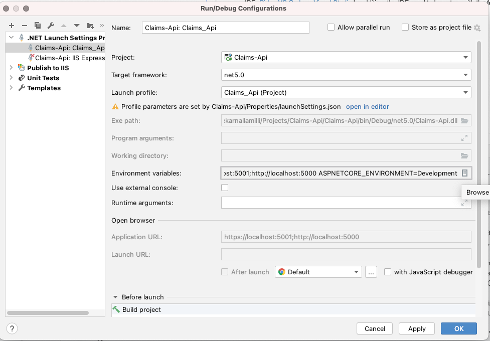

# Claims Api

The Claims-API is the backend API for Claims Service. It is written in C# and runs on .NET Core 5.0. [Dapper](https://github.com/DapperLib/Dapper) is used as orm layer and Unit of Work Repository pattern is used for CRUD operations.

## Set up locally

You will need:

- [.net core 5.0](https://dotnet.microsoft.com/download/dotnet-core/5.0)
- IDE: [Rider](https://www.jetbrains.com/rider/download/), [VS Code](https://code.visualstudio.com/download) or [Visual Studio](https://visualstudio.microsoft.com/downloads/)
In addition, the IDE need to be set up with the following configuration:

- SQL Server either in azure or running locally
- Swagger api Documentation json is [here](apiDoc/swagger.json)
- Postman Collection to import is [here](https://www.getpostman.com/collections/972fc2042eb79e5db882)

## Settings
Settings are now being read from appsettings.json. These can be overriden with environmental variables.
The important settings 

| Variable Name  | Desription |
| ------------- | ------------- |
| db_connectionstring  | Connection String for Sql Server  |
| db_schema  | DB Schema Name  |
| queue_connectionstring  | Azure Service Bus primary connection string |
| queue-name  | Azure Service Bus queue Name  |

##Migration
Migrations are not part of this project. To get the app running, the following migration needs to be ran in the SQL console after creating the db
# Database
Create
```sql
create database dbname;
```
Drop
```sql
drop database dbname;
```

# Table
Check if not exist and create
```sql
create table ClaimAudits
(
    Id         uniqueidentifier,
    ClaimId    uniqueidentifier not null,
    Name       nvarchar(255),
    Year       int,
    Type       nvarchar(16),
    DamageCost int,
    AuditTime  datetime default getdate()
)
go
```
## Related services

| Service   | Description |
| ------------- | ------------- |
| [Claim Audit Fucntion](https://github.com/chandrashekar-nallamilli/claim-audit-function)  |Handle auditing of all the claims  |

